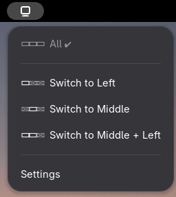
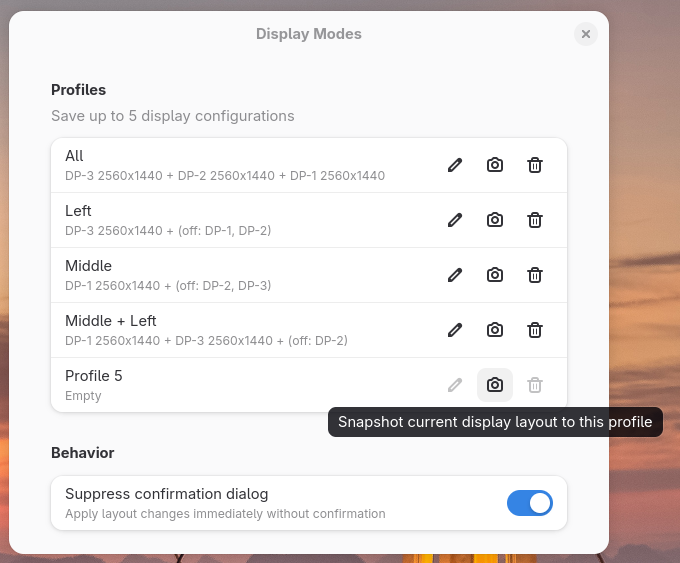

# Display Modes

A GNOME Shell extension to quickly switch between saved display configurations from the top bar.

Ideal for multi-monitor setups where you regularly switch between different arrangements — e.g. a productivity layout with all monitors active, a gaming layout with a single display, or a side project setup with specific monitors turned off.

| Panel menu | Settings |
|:---:|:---:|
|  |  |

## Features

- **One-click switching** — select a saved display layout from the panel menu and it applies instantly via Mutter's DBus API
- **Visual layout icons** — each menu entry shows a miniature diagram of the monitor arrangement, including disabled displays (shown dimmed with an X)
- **Active layout detection** — the menu highlights which saved profile matches your current display state
- **Up to 5 profiles** — save, rename, overwrite, or delete display configurations from the preferences panel
- **Usage-based ordering** — frequently used layouts appear first in the menu
- **Non-blocking** — all DBus calls are asynchronous to avoid freezing the compositor

## Supported GNOME Versions

GNOME Shell 45, 46, 47, 48, 49

## Installation

### From source

1. Clone this repository into your GNOME Shell extensions directory:

   ```bash
   git clone https://github.com/<your-username>/DisplayToggler.git \
     ~/.local/share/gnome-shell/extensions/display-modes@dennis@damenmail.nl
   ```

2. Compile the GSettings schema:

   ```bash
   glib-compile-schemas ~/.local/share/gnome-shell/extensions/display-modes@dennis@damenmail.nl/schemas/
   ```

3. Restart GNOME Shell (log out and back in on Wayland, or press `Alt+F2` → `r` on X11).

4. Enable the extension:

   ```bash
   gnome-extensions enable display-modes@dennis@damenmail.nl
   ```

## Usage

1. Click the display icon in the top bar to open the menu.
2. The current active layout is shown at the top with a checkmark.
3. Click any other layout to switch to it.
4. Open **Settings** to manage your profiles:
   - Click the **camera icon** to snapshot your current display configuration into a profile slot.
   - Click the **pencil icon** to rename a profile.
   - Click the **trash icon** to delete a saved profile.

## How It Works

The extension communicates with Mutter's `org.gnome.Mutter.DisplayConfig` DBus interface to read the current monitor state and apply saved configurations using `ApplyMonitorsConfig`. Layouts are stored as JSON in GSettings, capturing monitor connectors, resolutions, positions, scale, and transform for each logical monitor.

## License

GPL-2.0-or-later
